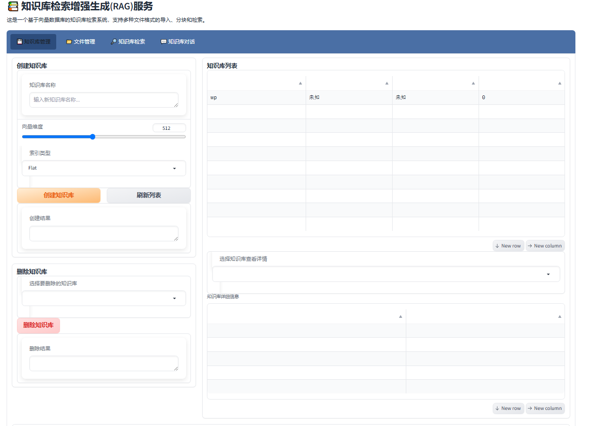
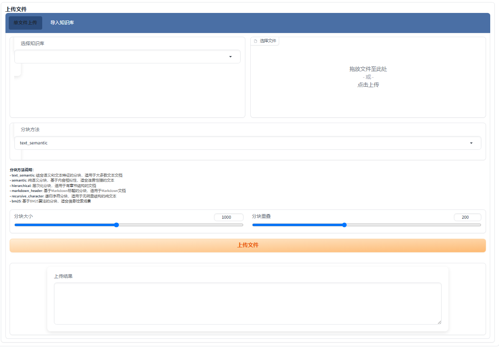

# EasyRAG - 轻量级本地知识库增强系统

[中文](README.md) | [English](README_EN.md)

## 项目简介

EasyRAG是一个基于本地知识库的智能问答系统，能够帮助用户快速检索和获取知识库中的信息。系统集成了向量检索和大型语言模型，实现了智能化的知识问答。通过DeepSeek 1.5B模型的支持，系统能够基于知识库检索结果生成更加智能和准确的回答。

## 界面预览

### 主界面


### 文件上传


### 知识库检索


### 智能对话


## 主要功能

- 知识库管理：创建、更新和删除知识库
- 文档处理：支持PDF、Word、文本等多种文档格式
- 智能检索：基于向量相似度的精准内容检索
- 智能问答：结合知识库内容生成准确的回答
- 本地部署：所有功能在本地运行，保障数据安全
- DeepSeek集成：使用DeepSeek 1.5B模型提供智能回答
- 上下文感知：支持上下文感知的对话
- 多样化分块策略：支持多种文档分块方法，包括新增的子标题分块，可保留大标题信息

## 系统要求

- 操作系统：Windows/Linux/MacOS
- 推荐Python版本：Python 3.9
- 内存：至少4GB（推荐8GB以上）
- 磁盘空间：至少需要5GB可用空间
- GPU（可选）：支持CUDA的NVIDIA GPU可提升性能

## 快速开始

### 一键部署

#### Windows用户

1. 双击`deploy.bat`文件
2. 脚本会自动检查Python环境，必要时下载并安装
3. 创建虚拟环境并安装所需依赖
4. 自动启动API服务器和Web界面

#### Linux/Unix用户

1. 打开终端，进入项目目录
2. 给脚本添加执行权限：`chmod +x deploy.sh`
3. 运行脚本：`./deploy.sh`
4. 脚本会自动检查环境，安装依赖并启动服务

### 手动安装

如果一键部署不适合您的环境，也可以按以下步骤手动安装：

1. 确保安装了Python 3.9
2. 创建虚拟环境：`python -m venv py_env`
3. 激活虚拟环境：
   - Windows: `py_env\Scripts\activate`
   - Linux/Mac: `source py_env/bin/activate`
4. 安装依赖：
   - CPU版本：`pip install -r requirements_cpu.txt`
   - GPU版本：`pip install -r requirements_gpu.txt`
5. 启动服务：
   - API服务器：`python api_server.py`
   - Web界面：`python ui_new.py`

### 重要说明：Faiss安装

**注意**：部署脚本暂时跳过了Faiss向量库的安装，因为在Windows环境下可能遇到编译问题。您需要手动安装Faiss才能使用完整的向量检索功能：

- CPU版本：`pip install faiss-cpu`
- GPU版本：`pip install faiss-gpu`

如果上述命令在您的环境中安装失败，可以尝试以下替代方法：

1. 使用预编译的wheel包：
   ```
   pip install faiss-cpu --only-binary=faiss-cpu
   ```

2. 或者从非官方源安装：
   ```
   pip install faiss-cpu -f https://dl.fbaipublicfiles.com/faiss/wheel/faiss_cpu-1.7.4-cp39-cp39-win_amd64.whl
   ```

3. 对于Linux用户，可以尝试：
   ```
   pip install faiss-cpu -f https://dl.fbaipublicfiles.com/faiss/wheel/faiss_cpu-1.7.4-cp39-cp39-linux_x86_64.whl
   ```

## 使用说明

启动服务后，在浏览器中访问以下地址：

- Web界面：`http://localhost:7861`
- API服务：`http://localhost:8000`

### 创建知识库

1. 访问Web界面，选择"知识库管理"选项卡
2. 点击"创建知识库"，输入知识库名称
3. 上传文档或粘贴文本
4. 系统会自动处理文档并构建索引

### 使用知识库问答

1. 选择"知识库对话"选项卡
2. 选择已创建的知识库
3. 输入问题并发送
4. 系统会检索相关内容并使用DeepSeek模型生成回答

## 系统架构

- `api_server.py`：后端API服务
- `ui_new.py`：Web用户界面
- `core/`：核心功能模块
  - `kb_doc_process.py`：文档处理模块
  - `kb_vector_store.py`：向量存储模块
  - `llm_model.py`：语言模型模块（包含DeepSeek模型支持）
- `deploy.bat`/`deploy.sh`：部署脚本

## 技术细节

### 模型信息

- 使用的模型：DeepSeek-Chat-1.5B-Base
- 模型来源：ModelScope
- 模型大小：约3GB
- 首次使用时会自动下载到本地

### 文档分块策略

系统支持多种文档分块策略，适用于不同类型的文档：

- 语义分块：根据语义边界划分文档，适合一般文本
- 递归字符分块：基于字符级别的分块，适合非结构化文本
- Markdown标题分块：基于Markdown标题的分块，适合有明确标题的文档
- 层次分块：保留文档层次结构的分块方法
- 子标题分块：专为技术文档和白皮书设计，按小标题分块同时保留大标题信息，便于精确检索

分块策略可在知识库创建时选择，也可通过API进行自定义配置。

## 问题排查

如遇到问题，请检查：

1. 网络连接是否正常（首次运行需要下载模型）
2. 磁盘空间是否充足（至少需要5GB可用空间）
3. 查看命令行窗口中的错误信息
4. 检查faiss是否成功安装（使用`pip list | grep faiss`命令）

### 常见问题解决方案

#### 1. OpenCV依赖错误

如果遇到类似以下的OpenCV错误：
```
ImportError: libGL.so.1: cannot open shared object file: No such file or directory
```

这是因为缺少OpenCV所需的图形库依赖。解决方法：

**Ubuntu/Debian系统**：
```bash
sudo apt-get update
sudo apt-get install -y libgl1-mesa-glx
```

如果OCR功能还需要其他依赖，可同时安装这些常用图形库：
```bash
sudo apt-get install -y libglib2.0-0 libsm6 libxrender1 libxext6
```

**CentOS/RHEL系统**：
```bash
sudo yum install mesa-libGL
```

**Arch Linux**：
```bash
sudo pacman -S mesa
```

安装完依赖后，重新运行启动脚本。

## 注意事项

1. 模型初次加载需要下载约3GB数据，请确保网络畅通
2. 在CPU环境下，模型响应可能较慢，建议有GPU的环境运行
3. 部署脚本需要管理员/root权限安装Python（如果系统中不存在）

## 技术栈

- 前端：Gradio
- 后端：FastAPI
- 向量检索：Faiss
- 语言模型：DeepSeek 1.5B和其他支持的模型

## 后续改进方向

1. 添加更多大型语言模型选择
2. 优化模型推理速度
3. 添加模型参数调整界面
4. 增强多轮对话能力

## 授权信息

本项目仅供学习研究使用，不可用于商业目的。